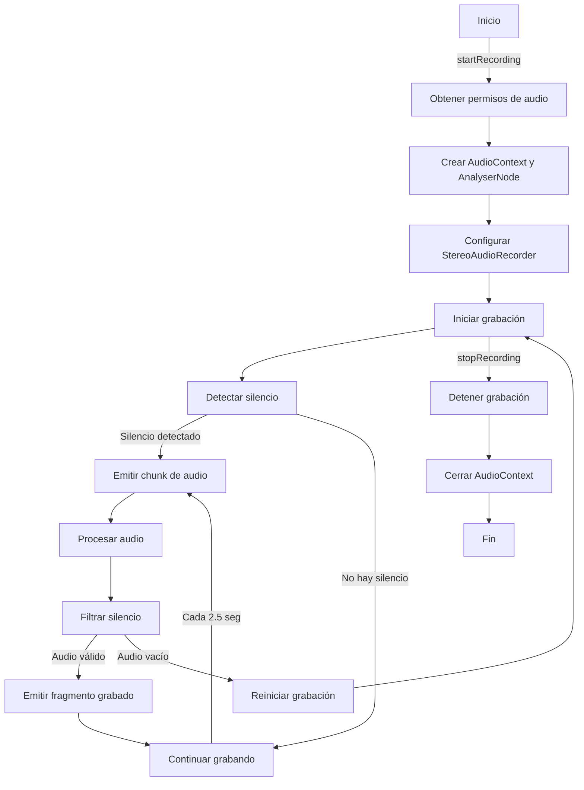

```mermaid
graph TD;
    A[Inicio] -->|startRecording| B[Obtener permisos de audio]
    B --> C[Crear AudioContext y AnalyserNode]
    C --> D[Configurar StereoAudioRecorder]
    D --> E[Iniciar grabación]
    E --> F[Detectar silencio]
    
    F -->|Silencio detectado| G[Emitir chunk de audio]
    F -->|No hay silencio| H[Continuar grabando]

    G --> I[Procesar audio]
    I --> J[Filtrar silencio]

    J -->|Audio válido| K[Emitir fragmento grabado]
    J -->|Audio vacío| L[Reiniciar grabación]

    K --> H
    L --> E

    H -->|Cada 2.5 seg| G

    E -->|stopRecording| M[Detener grabación]
    M --> N[Cerrar AudioContext]
    N --> O[Fin]

```
